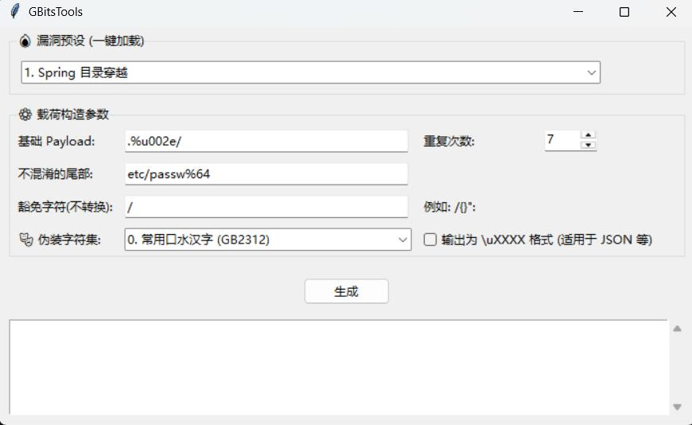

# GBitsTools
本工具的理论基础来源于 **Black Hat Asia** 议题：*https://i.blackhat.com/Asia-26/Presentations/Asia-26-Bai-Cast-Attack-Ghost-Bits-4.23.pdf*




## 核心原理

Java 中的 char 类型是基于 16 位（Unicode）的，而字节 byte 是 8 位的。
当存在缺陷的 Java 应用程序或中间件（如 Jetty, Tomcat, 原生 JDK 方法）在处理字符串时，如果发生**从 char 到 byte 的强制类型转换**，高 8 位的二进制数据会被直接截断丢弃。


使用方法

```python3 ghost_bits.py -h  #启动命令行模式 (CLI) 查看帮助
git clone https://github.com/YourUsername/GhostBits-Generator.git
cd GhostBits-Generator

# 启动图形化界面 (GUI)
python3 ghost_bits.py

# 启动命令行模式 (CLI) 查看帮助
python3 ghost_bits.py -h
```

**推荐方案 使用 Yakit或Python发包**

复现环境：https://github.com/vulhub/vulhub/tree/master/spring/CVE-2025-41242

本工具由AI快速构建，用于个人研究便捷复现。各个功能并不完善，另外pdf还没读透待我再学习学习
